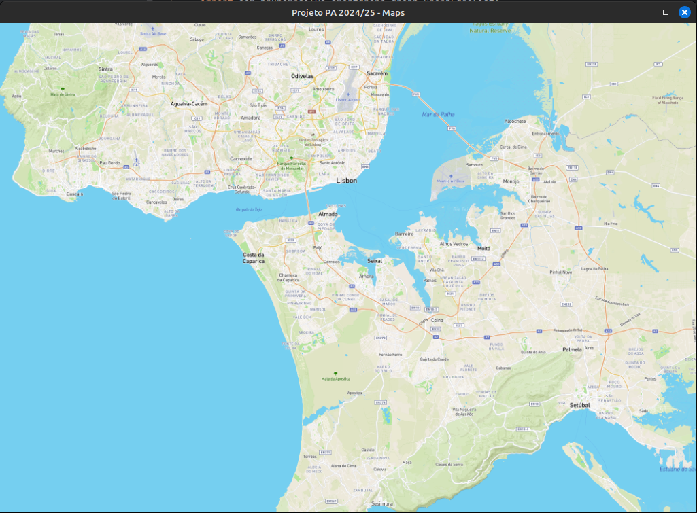

# Advanced Programming Project 2024/25 - Resource Season

The project statement is available on the Curricular Unit's Moodle.

Executing the `main` method should produce the following result:

## Libraries/dependencies

The project contains the following dependencies imported via _Maven_:

- JUnit 5.8.1
- SmartGraph 2.0.0
- GSON 2.11.0

## Java Development Kit

You must use a version of the Java Development Kit (JDK) that supports JavaFX. The recommended version for the Course Unit is BellSoft Liberica JDK, version **17 LTS (FULL)**. Download available at https://bell-sw.com/pages/downloads/#/java-17-lts